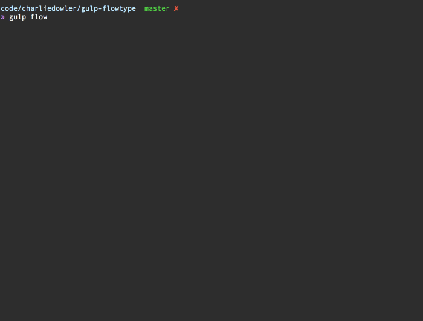

## gulp-flowtype [![Build Status][travis-image]][travis-url] [![NPM version][npm-image]][npm-url] [![Dependency Status][depstat-image]][depstat-url] [![Gitter chat][gitter-image]][gitter-url]

> Run [Facebook's Flow](http://flowtype.org/) in your gulp pipeline



## Installation
```shell
$ npm install --save-dev gulp-flowtype
```

### Usage

```js
var react = require('gulp-react');
var flow = require('gulp-flowtype');

gulp.task('typecheck', function() {
  return gulp.src('./*.js')
    .pipe(flow({
        all: false,
        weak: false,
        declarations: './declarations',
        killFlow: false,
        beep: true,
        abort: false
    }))
    .pipe(react({ stripTypes: true })) // Strip Flow type annotations before compiling
    .pipe(gulp.dest('./out'));
});
```

### Options

##### options.all
Type: `Boolean`
Default: `false`
>Typecheck all files, not just @flow.

##### options.weak
Type: `Boolean`
Default: `false`
>Typecheck with weak inference, assuming dynamic types by default.

##### options.declarations
Type: `String`
Default: `empty`
>The path to declared files (interfaces) to third-party libraries

##### options.killFlow
Type: `Boolean`
Default: `false`
>Kills the Flow server after Typecheck is finished.

##### options.beep
Type: `Boolean`
Default: `true`
>Notify your command prompt of a Typecheck error with a beep

##### options.abort
Type: `Boolean`
Default: `false`
>Abort the gulp task after the first Typecheck error

##### options.reporter
Type: `function`
Default: [charliedowler/flow-reporter](https://github.com/charliedowler/flow-reporter)
>Optionally specify a custom reporter.

## Release History
 * 2016-08-04    v1.0.0    [Improvement] Update dependencies + Add support for new flow format
 * 2016-01-18    v0.4.9    [Improvement] Update dependencies + fix broken code [#38](https://github.com/charliedowler/gulp-flowtype/pull/38)
 * 2015-09-13    v0.4.8    [Fix] Downgrade flow
 * 2015-05-05    v0.4.7    [Improvement] Add option for custom reporter
 * 2015-04-10    v0.4.6    [Fix] Move flow-bin to peerDependencies + [#25](https://github.com/charliedowler/gulp-flowtype/issues/25) Fix abort option
 * 2015-02-24    v0.4.5    [Bump] flow-bin `v0.4.0`
 * 2015-02-15    v0.4.4    [Fix] [#19](https://github.com/charliedowler/gulp-flowtype/issues/19) Reset passed value when finished
 * 2015-02-07    v0.4.3    [Fix] Move dependency from devDependencies to dependencies
 * 2015-02-06    v0.4.2    [Improvement] Add beep, abort on error and option to override flow executable (broken)
 * 2014-12-15    v0.4.1    [Improvement] Performance improvements & better error handling
 * 2014-11-26    v0.4.0    [Improvement] Tweak success message, check file has `/* @flow */` before running flow and added options
 * 2014-11-23    v0.3.1    [Fix] Changes to previous formatting fix
 * 2014-11-23    v0.3.0    [Fix] Repair formatting issues
 * 2014-11-21    v0.2.0    [Improvement] General improvements
 * 2014-11-19    v0.1.0    Initial release

## Contributing
1. Write test (if applicable)
2. Write code
3. Make tests pass
4. Execute `npm run lint` and make amendments if needed
5. Create pull request
6. Rinse and repeat

## License

MIT © Charlie Dowler

[travis-url]: http://travis-ci.org/charliedowler/gulp-flowtype
[travis-image]: https://secure.travis-ci.org/charliedowler/gulp-flowtype.png?branch=master

[npm-url]: https://npmjs.org/package/gulp-flowtype
[npm-image]: https://badge.fury.io/js/gulp-flowtype.png

[travis-url]: http://travis-ci.org/charliedowler/gulp-flowtype
[travis-image]: https://secure.travis-ci.org/charliedowler/gulp-flowtype.png?branch=master

[depstat-url]: https://david-dm.org/charliedowler/gulp-flowtype
[depstat-image]: https://david-dm.org/charliedowler/gulp-flowtype.png

[gitter-url]: https://gitter.im/charliedowler/gulp-flowtype
[gitter-image]: https://badges.gitter.im/gitterHQ/gitter.png
