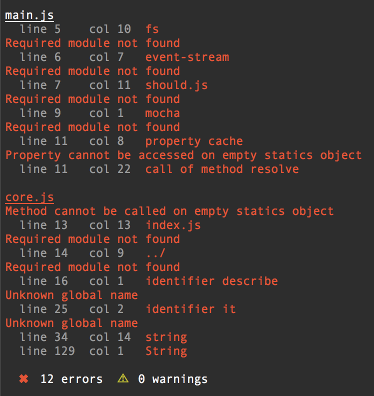

## gulp-flowtype [![Build Status][travis-image]][travis-url]

> Run [Facebook's Flow](http://flowtype.org/) in your gulp pipeline



## Installation
```shell
$ npm install --save gulp-flowtype
```

### Usage

```js
var flow = require('gulp-flowtype');
gulp.task('typecheck', function() {
  return gulp.src('./*.js')
    .pipe(flow());
});
```


[travis-url]: http://travis-ci.org/charliedowler/gulp-flowtype
[travis-image]: https://secure.travis-ci.org/charliedowler/gulp-flowtype.png?branch=master
